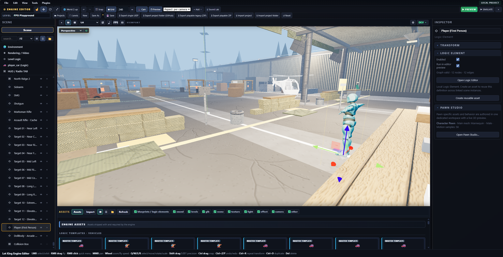
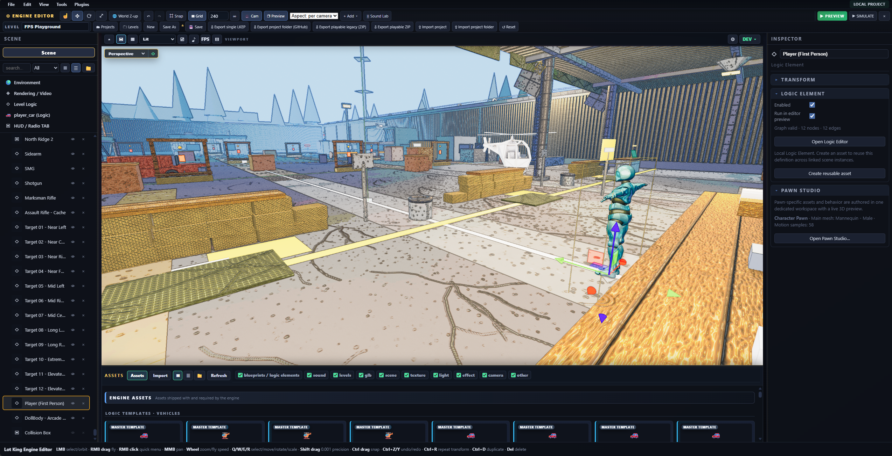
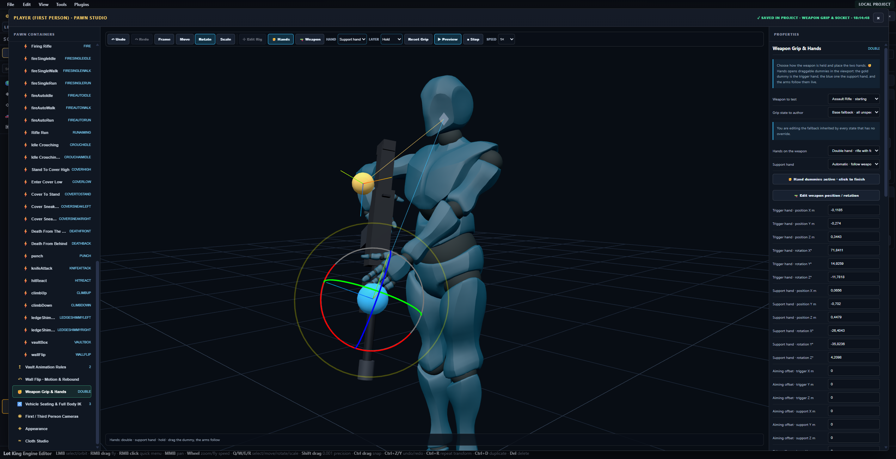
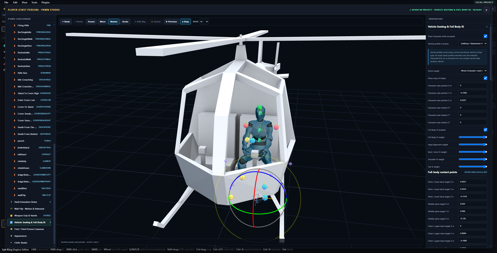
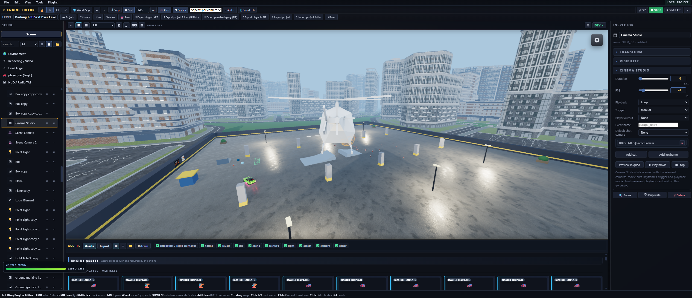
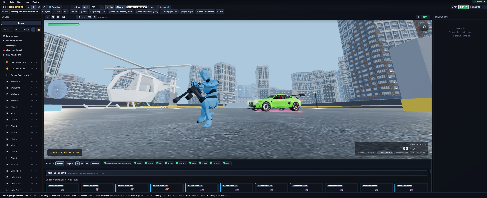

# Lot King — Browser-Native 3D Game Engine & Editor

[](https://jaydemks.github.io/lotking_EngineBuilder-AndCarDriftGame/)
[](https://github.com/sponsors/jaydemks)

> It started as a parking-lot drift prototype.<br>
> It is now a local-first, browser-native engine for building, testing, collaborating on and exporting playable 3D experiences.

**Current version: `v0.7.9` · Experimental Alpha**

[Open Lot King Online](https://jaydemks.github.io/lotking_EngineBuilder-AndCarDriftGame/) ·
[Technical README](README_TECHNICAL.md) ·
[How to Start](HOW_TO_START.md) ·
[Release History](docs/releases/)

---

## What is Lot King?

Lot King is an experimental, local-first 3D game engine and visual editor that runs entirely in the browser. Version `0.7.9` builds on the expanded vehicle, Character, procedural-world, illustrated-rendering, Cinema Studio, collaboration and optional Blender Live Link foundations introduced in the previous release.

It began as a small car drift game, but it is not a car-only editor. It is gradually growing into a tool for assembling imported 3D assets into levels, interactive visuals and playable browser projects, then connecting them through physics, animation, cinematics, sound and visual JavaScript logic.

Lot King is not a complete 3D modelling package. Vehicles, characters and other complex meshes are normally created in Blender or another dedicated tool and then imported as GLB, GLTF or FBX assets. Inside Lot King you can place and transform your own models, then use its mesh, material, texture, animation, collision, rig and Pawn Studio tools to adapt them to gameplay.

For vehicles, `tools/blender 5.0+` includes the optional open-source Vehicle GLB Rigger 0.3.0 source and Blender-built ZIP. It supports the established car wheel, brake and steering setup plus guided Normal and DollBody-compatible vehicle and aircraft workflows.

The main workflow is simple:

**Assemble an experience → test it immediately → export it for the browser.**

Today, the easiest ready-to-use results are still simple games and 3D visuals, with car racing and drifting as the most complete gameplay path. Editable starter templates and a shared objective system cover several additional game types; broader one-step rules and fully customizable UI flows are still being developed.

Logic Elements already provide a Blueprint-inspired way to create many custom interactions and gameplay dynamics through visual JavaScript logic. The system will become broader and easier over time, with development guided by real testing, feedback, contributions and other forms of community support.

Lot King is not intended to replace established engines. It is an ongoing attempt to see how far a local-first, browser-only engine can be pushed.

For me, Lot King is already a major project and something I am proud of. It is not perfect—hundreds of fixes, refinements and additions remain—but even at this stage, what it can already do is remarkable.

---

## v0.7.8 editor screenshots

Captured directly from the `v0.7.8` release.

<table>
  <tr>
    <td></td>
    <td></td>
  </tr>
  <tr>
    <td></td>
    <td></td>
  </tr>
  <tr>
    <td></td>
    <td></td>
  </tr>
</table>

---

## Videos

### v0.7.1 editor and gameplay preview

https://github.com/user-attachments/assets/9c1c8dc2-2d93-4434-958f-23d9f546ac55

### Earlier v0.6.x preview

https://github.com/user-attachments/assets/c481af98-95d2-46b7-aac4-99a6be812e85

The current release contains additional systems and fixes that are not shown in these videos yet.

---

## What can it do now?

- Build local-first projects with multiple levels, custom 3D menu scenes, reusable Logic Elements and editable game-mode starters.
- Import GLB, GLTF, FBX and PBR assets, or keep supported scene objects and assets synchronized with Blender through the optional Live Link.
- Author collision, physics, materials, cameras, lights, weather, sound, UI, objectives and procedural assets directly in the editor.
- Use stable WebGL 2 rendering or experiment with WebGPU and its automatic fallback, Ray Lighting and progressive Path Tracing.
- Turn the complete scene or individual materials into a configurable colour or monochrome illustrated Manga / paper-sketch style.
- Generate performant island terrain, water and distant archipelagos around existing playable areas.
- Build car, truck, trailer, motorcycle, bicycle, boat, airplane and helicopter gameplay through native or reusable Logic vehicle foundations.
- Enter and leave vehicles with visible occupants, authorable full-body seating, engine sound, damage, destruction and towing support where applicable.
- Configure Character, Animal, Vehicle and Soccer Pawns around imported assets or engine placeholders.
- Build first- and third-person character gameplay with responsive animation blending, traversal, combat, inventory, physical death and contextual weapon grips through the evolving Pawn Studio workflow.
- Create reusable Cinema Studio sequences with variable duration, editable spline motion, presets and frame-accurate WebM rendering.
- Collaborate in realtime through encrypted browser-to-browser coworking with element locks and coordinated local saves, or build host-authoritative P2P multiplayer sessions.
- Test immediately through Play Preview or Simulate, then export portable projects, GitHub-safe split folders or standalone playable ZIP builds for static websites.

For the complete feature and architecture breakdown, read the
[Technical README](README_TECHNICAL.md).

---

## Browser and local workspaces

The hosted version works as a private writable browser workspace.

Projects and imported assets are stored only inside the current browser profile. They are not uploaded to GitHub or exposed to other visitors automatically; P2P coworking shares changes only inside a session the user deliberately joins.

Choosing a local folder is optional. It can be used as a portable mirror when direct file access is preferred.

Version `0.7.4` also adds a dedicated interface for inspecting and cleaning the LocalStorage, IndexedDB and cached data used by Lot King.

Important projects should still be backed up as `.lkep.json` files, split project folders, or stored in an authorized local folder. For the bundled online demo, export with base name `demo-project` into `demo/`; keep both `demo-project.lkep.json` and the adjacent `demo-project/` folder in Git.

---

## From v0.0.1 to v0.7.9

The first version, `v0.0.1`, was a small drift prototype created from one prompt.

The Git-ready public history began at `v0.5.0-beta`. Lot King has completed **30 public versioned milestones** through `v0.7.9`.

Each milestone preserves a real stage of the project rather than hiding the development history behind one final upload.

See the complete [release history](docs/releases/).

---

## One developer, fully AI-assisted

Lot King is built and directed by one person.

I have not manually typed the implementation code line by line. AI coding tools generate the code, but they do not decide what the project becomes.

I define the systems, design the workflows, divide the work into stages, test the results, find regressions, read the logs, reject wrong implementations, direct refactors and decide what is released.

**The code is AI-generated. The project is human-directed and orchestrated.**

---

## Try it

Open the hosted workspace:

**https://jaydemks.github.io/lotking_EngineBuilder-AndCarDriftGame/**

To run it locally on Windows:

```bat
avvio.bat
```

Then open:

```text
http://localhost:5700/
```

Opening the project directly through `file://` is not supported.

---

## Technology

Lot King currently uses:

- JavaScript, HTML and CSS
- Three.js `r185`
- Cannon.js
- Web Audio API
- LocalStorage and IndexedDB
- File System Access APIs where supported
- JSZip
- Playwright for browser testing

There is no mandatory framework, bundler or cloud backend.

---

## Current status

Lot King is usable, but still experimental.

The vehicle and drift workflow is the strongest part today, and on-foot shooter gameplay is the fastest moving. Character/animal animation, visual logic, Cinema Studio, P2P systems, browser compatibility and larger project round trips still need more testing and refinement. Common objectives now have an editable shared foundation; broader game rules and project-specific UI still need faster authoring.

The Character layer is playable but not yet optimized for every level. Pawn Studio and authored clips cover locomotion, traversal, weapon grips, cameras and vehicle seating, while retargeting, IK, animation edge cases and physical interactions still need refinement. To start testing these systems, create or open a Shooter level, which currently provides the most suitable Character setup. The current FPS limits are listed in full in [First Person Pawn](docs/FIRST_PERSON_PAWN.md).

Bugs and incomplete systems should be expected while development continues.

Custom models are supported and can be adapted with the editor's import, fitting, collision, material, animation, rigging and Pawn Studio tools. If a model or feature does not work as expected, please [report it](https://github.com/jaydemks/lotking_EngineBuilder-AndCarDriftGame/issues) with enough detail to reproduce it; reported regressions will be investigated and corrected as soon as possible.

Feedback, testing, documentation, example projects, reusable logic and other forms of support can all help the engine mature faster.

---

## Documentation

- [Technical README](README_TECHNICAL.md)
- [Startup guide](HOW_TO_START.md)
- [Current v0.7.9 release notes](RELEASE_NOTES_v0.7.9.md)
- [Architecture](docs/ARCHITECTURE.md)
- [Runtime modules](docs/RUNTIME_MODULES.md)
- [First Person Pawn](docs/FIRST_PERSON_PAWN.md) — the shooter layer: rig, traversal, items, interactions, vitals and inventory
- [Release history](docs/releases/)

A screenshot-based manual may be added later, when the interface is stable enough that hundreds of screenshots will not immediately become outdated.

---

## Credits

Lot King builds on [Three.js](https://threejs.org/), [cannon.js](https://github.com/schteppe/cannon.js) and [JSZip](https://stuk.github.io/jszip/).

The optional advanced Pawn family and parts of the bundled demo adapt vehicle
physics, vehicle systems and Character foundations from Jan Bláha's
MIT-licensed [Sketchbook](https://github.com/swift502/Sketchbook). Sincere
thanks to [Jan Bláha (`swift502`)](https://github.com/swift502) and to the
contributors thanked by the original project:
[aleqsunder](https://github.com/aleqsunder),
[barhatsor](https://github.com/barhatsor) and
[danshuri](https://github.com/danshuri).

The progressive Path Tracing mode uses Garrett Johnson's
[three-gpu-pathtracer](https://github.com/gkjohnson/three-gpu-pathtracer). The
realtime path-tracing research and extensive browser demos by
[Erich Loftis (`erichlof`)](https://github.com/erichlof), especially
[THREE.js-PathTracing-Renderer](https://github.com/erichlof/THREE.js-PathTracing-Renderer),
are credited as a principal technical and visual reference.

The 3D city used as the background environment in the bundled demo is
[Modern City Block](https://sketchfab.com/3d-models/modern-city-block-c80dba249d9547cbb48d00828d23cfa7)
by [akselmot](https://sketchfab.com/akselmot). The model is currently listed
under the Sketchfab Free Standard License; creator credit is included
voluntarily and also preserves attribution for copies distributed under
earlier [CC BY 4.0](https://creativecommons.org/licenses/by/4.0/) terms. The
demo copy was converted and adapted for the Lot King scene.

See the repository documentation and third-party notices for additional credits and asset provenance.

Music is included and may be used in Lot King projects. If you enjoy it, please support the artists with a follow, comment, like or share; [Num0 is on YouTube](https://www.youtube.com/@Num0-music).

## License

The project is publicly **source-available** under the custom
[Lot King Source License 0.1](LICENSE). It is not released under an OSI-approved open-source license.

---

Built and directed by **Giò / Jaydem**

[GitHub](https://github.com/jaydemks) ·
[X](https://x.com/jaydem_world) ·
[LinkedIn](https://www.linkedin.com/in/giodemiccoli/)
